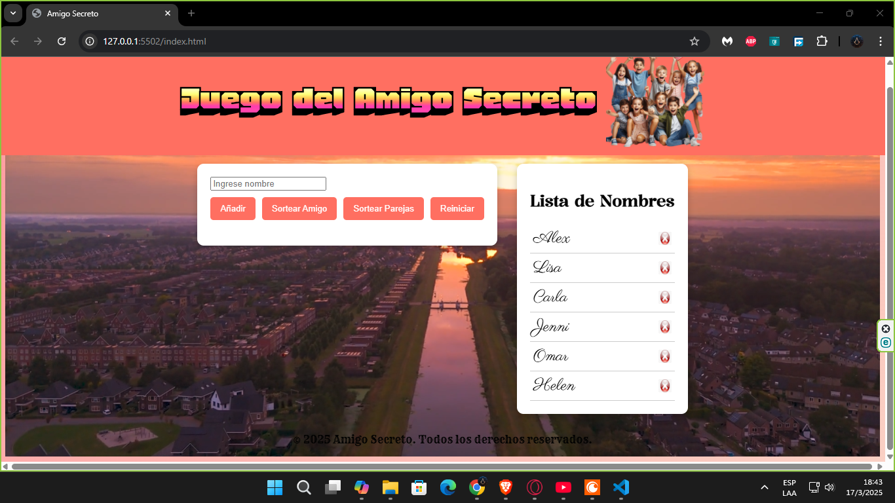
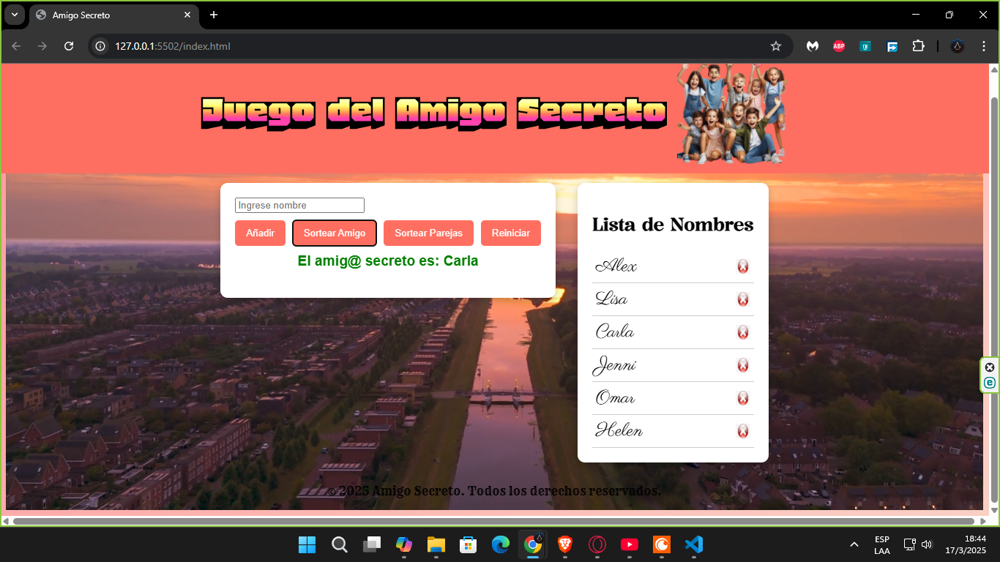
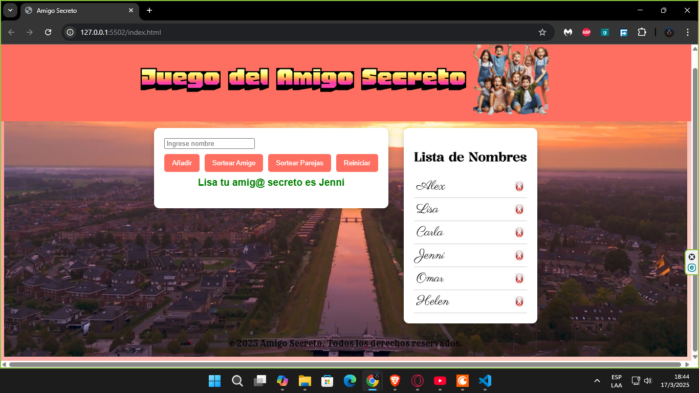

# 🌟 Amigo Secreto ONE🎁

**Amigo Secreto** es una aplicación web divertida e interactiva que permite realizar sorteos de amigos secretos de manera sencilla y rápida. ¡Ideal para celebraciones y eventos especiales! 🎉

---

## 🚀 Características ✨

✅ **Añadir nombres** a la lista de participantes.

✅ **Eliminar nombres** fácilmente.

✅ **Sortear un amigo secreto** aleatoriamente.

✅ **Opción para sortear parejas**.

✅ **Interfaz moderna** con fondo animado.

✅ **Mensajes emergentes** en pantalla.

---

## 📸 Capturas de pantalla 🖼️

Aquí algunas imágenes del funcionamiento de la aplicación:

### 🏠 Pantalla principal:


### 📝 Nombres ingresados:


### 🎁 Sorteo del amigo secreto:


### 🔀 Sorteo de parejas:


💡 Para agregar tus imágenes en GitHub, súbelas a la carpeta `assets` y usa la sintaxis anterior.

---

## 🛠 Tecnologías utilizadas 🧑‍💻

🚀 **HTML5** - Estructura del proyecto.

🎨 **CSS** - Estilos y animaciones.

⚡ **JavaScript (JS)** - Lógica y funcionalidad.

---

## 📥 Instalación y uso 🛠️

1️⃣ Abre el archivo index.html en un navegador web. 

2️⃣ Ingresa los nombres de los participantes en el campo correspondiente.

3️⃣ Usa el botón "Añadir" para agregarlos a la lista. 

4️⃣ Presiona "Sortear Amigo" para obtener un amigo secreto aleatorio. 

5️⃣ También puedes presionar "Sortear Parejas" para generar pares aleatorios.

6️⃣ Si deseas reiniciar el sorteo, presiona el botón "Reiniciar".

7️⃣ ¡Comienza a sortear! 🎉

---

## 📂 Estructura del proyecto 📁
```
📂 amigo-secreto
│-- 📂 assets/               # Imágenes y videos
│-- 📜 index.html            # Estructura principal del sitio
│-- 📜 styles.css            # Estilos y apariencia
│-- 📜 scriptvideo.js        # Funcionalidad en JS
│-- 📜 README.md             # Documentación del proyecto
```

---

## 👨‍💻 Autor 🖊️

👤 **Juan Flores**

📢 Si deseas contribuir, ¡haz un fork y envía tus mejoras! 😊

💡 **Licencia:**
- Este proyecto es de uso libre y puede ser modificado o distribuido según sea necesario. 🚀


