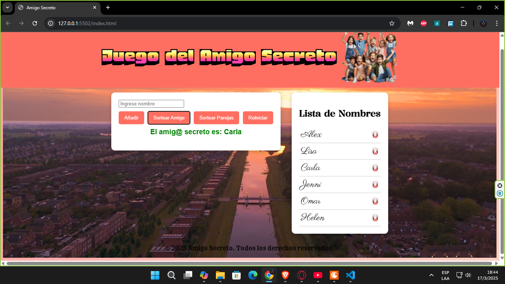

# 🌟 Amigo Secreto 🎁

**Amigo Secreto** es una aplicación web divertida e interactiva que permite realizar sorteos de amigos secretos de manera sencilla y rápida. ¡Ideal para celebraciones y eventos especiales! 🎉

---

## 🚀 Características ✨

✅ **Añadir nombres** a la lista de participantes.

✅ **Eliminar nombres** fácilmente.

✅ **Sortear un amigo secreto** aleatoriamente.
✅ **Opción para sortear parejas**.
✅ **Interfaz moderna** con fondo animado.
✅ **Mensajes emergentes** en pantalla.

---

## 📸 Capturas de pantalla 🖼️

Aquí algunas imágenes del funcionamiento de la aplicación:

### 🏠 Pantalla principal:


### 📝 Nombres ingresados:


### 🎁 Sorteo del amigo secreto:


### 🔀 Sorteo de parejas:


💡 Para agregar tus imágenes en GitHub, súbelas a la carpeta `assets` y usa la sintaxis anterior.

---

## 🛠 Tecnologías utilizadas 🧑‍💻

🚀 **HTML5** - Estructura del proyecto.
🎨 **CSS3** - Estilos y animaciones.
⚡ **JavaScript (JS)** - Lógica y funcionalidad.

---

## 📥 Instalación y uso 🛠️

1️⃣ Clona el repositorio en tu máquina:
```sh
   git clone https://github.com/tu-usuario/amigo-secreto.git
```

2️⃣ Abre el archivo `index.html` en tu navegador favorito.

3️⃣ ¡Comienza a sortear! 🎉

---

## 📂 Estructura del proyecto 📁
```
📂 amigo-secreto
│-- 📂 assets/               # Imágenes y videos
│-- 📜 index.html            # Estructura principal del sitio
│-- 📜 styles.css            # Estilos y apariencia
│-- 📜 scriptvideo.js        # Funcionalidad en JS
│-- 📜 README.md             # Documentación del proyecto
```

---

## 👨‍💻 Autor 🖊️

👤 **Juan Flores**

📢 Si deseas contribuir, ¡haz un fork y envía tus mejoras! 😊

💡 **Notas:**
- Si quieres publicar el proyecto online, sigue la guía de [GitHub Pages](https://pages.github.com/). 🚀


